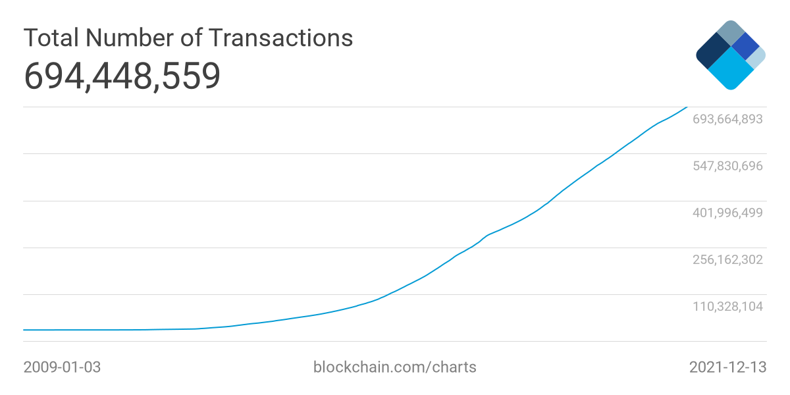
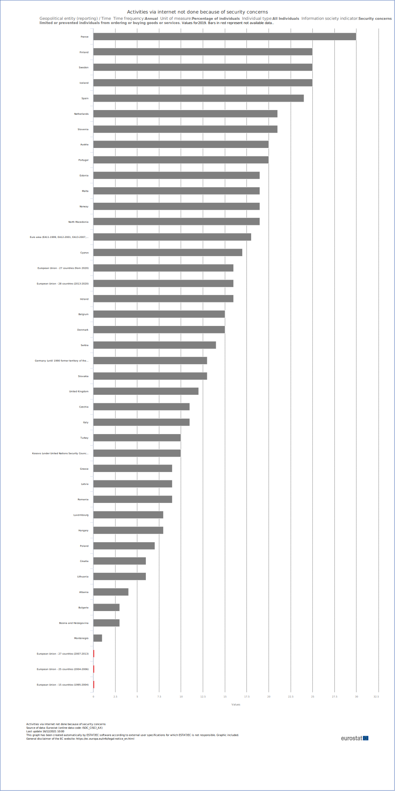

# Produktor Business Plan

The recession in which the modern world finds itself is globally recognized as the most severe in the last 90 years. The stratification of society, the deep economic crisis and the crisis of the functioning of markets, the growing interference of states and interstate associations in the daily life of individuals - these are not all the negative effects of the rapid technological, informational development, as well as the existing pandemic that we can observe.

Under these conditions, we can note the global trend of ordinary users to use those mechanisms and tools when participating in markets (by this we mean not only trading or investing, but also the daily processes of buying/selling goods and services), which allow:

* reduce the number of procedures and intermediaries required to complete a transaction between buyer and seller.
* provide the user with more anonymity and better protection of their data.
* in general, provide the user with a greater number of options to ensure the safety of his funds and protect them from inflationary processes.

Back in 1989, the company [DigiCash](https://ru.wikipedia.org/wiki/DigiCash) launched a digital cash system with anonymous transactions. Subsequently, this company ceased its activities, including due to a possible too early entry into the market.

In 1997, Adam Beck proposes a concept he developed [Hashcash](https://ru.wikipedia.org/wiki/Hashcash), which is essentially one of the prototypes of the Bitcoin protocol. The Hashcash algorithm is a Proof-of-Work system and was designed to reduce spam and DoS attacks.

In 2009, someone named Satoshi Nakamoto publishes the Bitcoin Whitepaper, in which he describes the principles of a decentralized peer-to-peer payment system. From this moment, we can start counting the full history of cryptocurrencies.

As of the end of 2022, there are more than 11,000 different cryptocurrencies in the world. The capitalization of various cryptocurrencies on the market varies from millions to hundreds of billions of dollars, the number of market users and the number of transactions in the networks is steadily growing.

---

### Cryptocurrency markets today

The growth of the total capitalization of cryptocurrency markets.

### Transaction amount

Increase in the number of transactions in the Bitcoin network.

The potential of cryptocurrencies based on decentralized systems and technologies to solve the problems of the centralized global market is undeniable, and this is confirmed by the steadily growing level of people's trust in this type of asset. Nevertheless, for all the development of technology, crypto-assets have not yet been fully integrated into the market sphere.

If we talk about modern markets, in one way or another related to cryptocurrencies, we can identify a number of key issues of paramount importance to the user.

## Current situation analysis

A lot of cryptocurrency projects provide one way or another the possibility to exchange the specified assets, but at the same time do not provide users with the possibility to use crypto-assets as an equivalent local means of payment/asset for intermediate exchange and expression of value of goods/services.

The existing applications do not take into account the need to keep records of acquisitions and sales, users do not have the ability to record information about transactions in a certain format in order to generate a service reporting documentation, which closes the access to the use of such applications by users in the status of a business entity.

The majority of users wishing to place a product/service for sale on the Internet face difficulties already at the initial stage:

* The **complexity of procedures** for specifying information about the product/service, description, uploading images.

* **Difficulties in price finding** due to the absence of price analysis mechanisms.

* The **complexity of ensuring control** over the execution of the terms of transactions, the presence of the risk of default by the parties to the transaction.

To ensure the reliability of transactions, it is often necessary to involve intermediaries - banks, notaries, lawyers, which increases the cost of transactions with goods/services for the user and lengthens their timing.

Analysis of sales markets is carried out in most cases by traditional methods and takes place at the expense of primitive surveys. This, in turn, leads to the fact that market participants do not have sufficiently accurate information about needs and intentions of buyers/sellers of goods and services.

> 

> Figure 3. Percentage of private e-commerce participants in the EU who refused to purchase goods and services due to excessive platform complexity or excessive security requirements:

### Development of the idea

Interest in platforms that provide the greatest degree of interaction of users with each other and with the world around them emerged a long time ago and was developed in the formation of the concept of Web 3.0. A decentralized Internet that is not subject to control and censorship will inevitably allow the creation of ever better content and offer ever-increasing quality of services.

One of the interesting projects aimed at the practical implementation of the Web 3.0 concept was OpenBazaar, created in 2014. The project involved the creation of a decentralized platform allowing users to engage in online commerce using BTC.

An impressive community was formed around the project; by mid-2016, the project had more than 100,000 downloaded participants, and the service itself won three BlockchainAwards-2016 nominations - "Most Promising User Application," "Best New Startup" and "Bitcoin Champion of the Year.

However, despite the growing number of users (the OpenBazaar software was eventually installed more than 250,000 times), the service was subsequently discontinued for reasons unrelated to the decline in user interest (to this day, the user community is asking questions about the timing of resuming the service, or launching a similar one). As one of OpenBazaar co-founders Brian Hoffman said in his [interview](https://www.coindesk.com/business/2021/07/15/openbazaar-co-founder-explains-why-web-3s-answer-to-ebay-folded-its-tents/) to the Coindesk platform:

>...As for why OpenBazaar has not become widespread, there are countless possible reasons. The biggest one I can point to is that cryptocurrency, bitcoin in particular, went from being a cheap alternative to cash to a store of value - digital gold - which was not conducive to everyday shopping in e-commerce like Amazon. When Ethereum came along and took the bulk of the dapp from bitcoin, we were hesitant to join its board. I'm not sure it would have helped us, because so far no Ethereum-based alternative to OpenBazaar has emerged that has gotten much traction. Most of them have switched to selling only digital goods or unplayable tokens, which are much better suited to the instantaneous nature of cryptocurrency.

The aforementioned factors persist at the present time, and the degree of their influence on user sentiment is also growing. At the same time, the platform that could occupy the OpenBazaar niche does not exist to this day, and the created (even if not fully advertised) niche in the modern market remains unoccupied.

At the same time, the last two years have seen a steady increase in the interest of the average consumer in the C2C sector. As follows from the analysis conducted by the [CROSS-BORDER] platform (https://www.cbcommerce.eu)

>The total turnover of the cross-border e-commerce market in Europe, including the UK, Switzerland and Norway, is €198.5 billion in 2020 (excluding travel costs), of which €115.4 billion, or 58%, comes from trading platforms. Amazon and eBay have the lion's share of the market, with expected turnover of €44.3 billion and €22.8 billion in 2020, more than half the market. The turnover of the top 100 cross-border trading platforms in Europe reaches 100 billion euros. 
> 
> During the COVID-19 pandemic, trading platforms grew by 37.5% at the expense of C2C trading platforms. This growth is expected to continue and. to reach 65% of cross-border online sales in Europe by 2025

Thus, the emergence of a complete platform in the sector that meets the needs of users in terms of security, reliability, speed of transactions and accessibility will inevitably attract to its use the ever-increasing percentage of customers who focus primarily on e-commerce and C2C business models.

## Product description

[Produktor.io](https://produktor.io) is a mobile application based on a proprietary mapping service. The app is designed to facilitate C2C communication for users by enabling them to either directly exchange goods/services, or to do so using cryptocurrencies as an intermediate exchange asset or a LOCAL equivalent of a payment instrument.

The idea of the application emerged as a reaction to the analysis of existing markets and their drawbacks (see Introduction). Both the disadvantages associated with the overall centralized structure of markets and the integration of crypto-assets into global market processes were analyzed.

### Issues under consideration and ways to solve them

From the *developers* point of view, the main drawbacks of the existing markets of turnover of goods (turnover of services) at the level of private users and small businesses can be identified as the following:

#### Communication instability

Lack of unified norms of interpretation of laws and rules, technical problems of modern networks, increasing degree of state interference in market processes, other well-known problems of centralized systems.

Communicational instability, in its turn, leads to very negative consequences, limiting the potential of the existing system for further development - reduction of users' trust in the platforms providing services of exchange and purchase/sale of goods and services,   accumulation of technical errors, which inevitably lead to malfunction of the existing systems, supply chain disorders, the need to use the services of a vast class of intermediaries (lawyers, notaries, banks, courts), especially in case of different kinds of problems, the need to use the services of the intermediaries of the existing systems.

#### High taxes and strict regulation in commodity turnover

Participation of small and medium businesses in commodity exchange operations results in inclusion by their representatives in the price of such goods of amounts of taxes and fees affecting ultimately the price of goods/services for the end consumer. As for participation of individuals in this sector, their activities are seriously restricted at the legislative level - exceeding the volume of transactions or limits of money turnover may lead to the procedure of recognizing such a market participant as a person in the status of entrepreneur without appropriate registration, with all the legal consequences arising from this.

#### Excessive presence of intermediaries in the market

In the existing system, based on centralized regulation and control, there is a large layer of persons providing the widest range of services that can be conditionally referred to the class of intermediaries. It is impossible to make payments without using the modern banking system as an intermediary, it is often necessary to go through special registration procedures to participate in full-fledged barter transactions, and the emergence of disputes  and differences in the terms of contracts and agreements causes the involvement of additional actors in the relationship between the parties to the transaction - lawyers, escrow agents, notaries, the courts.

#### Growing number of crypto-asset holders with limited ability to fully use them

In recent years, the number of Internet users, somehow connected with cryptocurrencies, is constantly growing. At the same time, user activity is limited to investment and trading activities, as full-fledged integration of crypto-assets into the existing markets is currently impossible, primarily due to the uncertainty of regulation of this industry at the interstate and state levels. A huge amount of crypto-assets are held by users in their wallets, without taking any  participation in the commodity turnover.

> **TODO**: Supplement with graphical information showing the growth of users of cryptocurrency markets (growth of accounts on cryptocurrency exchanges, growth of the number of wallets, growth of trading volume of major cryptocurrency exchanges)

### Main objectives

Based on the understanding of the problems described earlier, the developers of the project set themselves the following tasks:

#### Rationalization

Development of an application that rationalizes the existing system of intermediaries in trade transactions by automating most of the processes at the technical level, and making it easier for users to use Dapp to buy/sell goods and services.

#### Practical usage of crypto-assets

Development of a system that would allow users to fully use crypto-assets as a means of payment/exchange, thus contributing to the popularization of crypto-assets and increasing their integration into modern markets of goods and services

#### Transparent commercial activity

Development of a system that allows, in addition to the above, to analyze the commercial activity of users in order to improve market research methodologies and enable the identification of new markets.

### Technical facilities

These tasks will be solved in [Produktor.io]() by the following:

#### Exchange calendar

The ability to temporarily plan the provision of goods/services by the user (downloading the information and the schedule of work/providing goods or services)

#### Exchange map

Possibility of geolocation of goods/services delivery zone with indication of exact location or zone borders.

Additional features are:

* Product placement and publishing
* Local product searching
* Interactive map with editing abilities

#### Use of decentralized cryptocurrencies

Providing user with the possibility of quick and guaranteed crypto-assets exchange when performing transactions in the application, or direct use of crypto-assets as a local means of payment.

#### Object recognition system

The application will enable automatic detection and identification of goods/products from the image captured by a smartphone video camera, as well as recognition of significant properties and characteristics of the product using AI, such as:

- Product name (by photo)
- Product description (by name)
- Product images, video or other media
- Average price (zone-based analysis of online prices)

#### Efficient data saving

* Decentralized data distribution
* Efficient data storage based on IPFS/SkyDB

#### User-friendly user interface

Minimally simple, intuitive user interface using:

- **maps** - to display the location of the product/service.
- **calendar** - to determine when a product/service is available for purchase by users.
- a convenient system for specifying essential information about a product/service or essential terms of sale.
- **wish list** is a system that allows users to leave requests or requests for future availability of certain goods/services in areas specified by users. This system will allow sellers of goods/services to always respond to current market demands, as well as constantly improve the accuracy, completeness and reliability of statistical information about markets for market research and business analysis purposes.

**For more details, see also [F.A.Q.](FAQ.md) section**

### Services analyzing

One of the main functions of the application is also to improve accepted market analysis techniques by collecting and then analyzing the following information:

* Service or product search time for the user
* Service or product search zones
* Service or product delivery areas
* Place and time of periodic delivery (calendar) of the service or product
* Analysis of the intersection of the above indicators in order to accurately determine the current needs of market participants with respect to goods/services, their qualities, and the conditions of their provision to the user.

The formation of relevant data arrays will make it possible to subsequently provide this information to interested structures and organizations on a commercial basis, which will form one of the revenue items of the project budget.

It should be noted that most of the existing platforms and services providing some or other services related to crypto-assets do not provide the user with the possibility of full-fledged use of cryptocurrencies as a means of counter satisfaction for the provision of goods or services, limiting users' interaction with it exclusively to the investment or speculative trading framework. At the same time, even for such a limited scope of provided services, most of such services demonstrate significant *aggressiveness* in collection of personal information about the user, introducing complex and multistep procedures of user identity verification.

[Produktor.io]() is intended not only to enable its users to use their own crypto-assets as a means of payment for goods/services, but also to be able to do so with only as much personal information as determined by the user himself. The use of the cryptographic approach of a private and public key, and the system of exchange of users' public keys to confirm the validity and correctness of a transaction excludes the need to collect detailed information to verify the identity of the participants of such a
transaction.

Based on the above, you can determine the target audience of the project.

First, this category should include ordinary market participants (individuals) who wish to provide/receive services or sell/purchase goods not as part of commercial, but as part of everyday activities. The growth of the number of users of such platforms as [eBay](), [Amazon](), [AVITO]() and the like allows us to unambiguously determine the steady interest of this category for further growth and development of the sector.

Secondly, the target audience of the project is individual entrepreneurs, small and medium-sized businesses wishing to expand their customer base and range of goods/services offered by transferring sales to the Internet space, or already conducting such activities. This category would be interested not only in the proposed tools to analyze markets and build an effective commercial strategy, but also in the possibility of automated accounting of transactions and the formation of the necessary supporting documentation, as well as accounting and tax reporting documents.

Finally, market players such as large trading companies, market research agencies, and business planning agencies constitute the part of the target audience that will be primarily interested in the data set generated based on the analysis of the commercial activity of application users and of primary interest in conducting market analysis, identifying new markets, and developing commercial strategies for development and expansion.

### Initial calculation of project feasibility

When studying existing markets and platforms with similar functionality to [Produktor.io](), the developers came to the following conclusions:

### Pricing model

As conceived by the developers, the main income items from the operation of the application will be formed as follows:

The following is a description of the basic functionality of the application, as well as the advanced functionality provided to paid categories of users.

According to the proposed business model, the main income items of the project will be:

#### Fees

Transaction fees (thanks to a number of innovative technical solutions in blockchain, the application is able to perform transactions with minimal fees for the end user, which is one oc

#### Markets supply

Implementation of data about demand/supply on markets, data about geographical and temporal distribution of user requests, other statistical information obtained from collection and analysis of data about application users' activity.

#### Advertising

Placement of paid advertising content.

#### Advanced functionality

Registration of paid users with access to the application's extended functionality.

#### Enterprise support

Providing users with extended technical support services.

### Approximate distribution

The avg. distribution of future revenues by source of monetization:

Normal registration in the application (for all categories of users during the beta-testing period, for free accounts - after the full launch of the application) will give the user access to basic functionality, which includes the following features:

* Placement of information about offered goods/services.
* The system of determining the approximate price by searching for similar goods/services on the Internet and determining the average price indicators.
* Ability to identify goods by the following parameters:
  * ISDN.
  * Use of AI to identify goods/products by a photo taken by a user's smartphone camera.
  * Barcode.
  * QR-Code.
  * Through text analysis using OCR.
* Providing exchange of goods/services for crypto-assets:
  * Creating a transaction containing complete product/service information.
  * Distributed storage of information about the product/service and places of demand, as well as places of exchange, Accumulating information to analyze and understand markets
  * Maintenance of transactions through smart contracts.
* Performing product searches by category, globally on a map, or with preset search areas.
* Access to logistics services of specialized companies (locally and globally), without users without paying any additional fees.
* Management of cold wallets for the purpose of storage and exchange of crypto-assets by the user.

At the same time, in order to comply with current legislation, the application does not provide its own cold wallets, but only provides users with the ability to connect and use their wallets.

In the extended functionality, which the user is supposed to have access to, interaction with investors, sponsors, partners, negotiations, signing agreements and contracts.

* Project Manager support.
* Presentation of the project.
* preparation and signing of necessary investment agreements - in the interaction with the copywriter with paid accounts after the end of the beta-testing period, the following features are provided:

  * Automatic registration and storage of data on all performed transactions.
  * The possibility of automatic drawing up and keeping of accounting documents on the basis of data on operations, including automatic issuing of invoices on the fact of sales, automatic numbering of invoices, automatic registration of returns/replacement of goods.
  * Automatic preparation of tax reports on the basis of the automatic accounting data, enabling the user to make modifications in the manual mode.
  * **Important:** For users of their EU in the future you should also allow guest access to accounting data with commenting and approval rights - given the prevalence of hiring external accountants and tax advisers even at the private level, such an option will allow users to remain confident that their accounts are audited by their own advisers. Additionally, it will provide the application team with a reason to shift final responsibility for the completeness and accuracy of tax information to such
    consultants.
  * Enhanced market analysis capabilities.

>It is planned to introduce several levels of paid use, each of which will include all the functionality of the previous level plus extended functions or expanded scope of technical support.

## Roadmap

### Q1/2022

- launch of MWP based on TERA on the local market.
- testing.
- adaptation for the launch of the DCS.
- development and launch of the advertising campaign.
- development of a marketing campaign.
- involvement of the primary user level.
- preparation of the document base/CI.

### Q2/2022

- launch of an active marketing campaign.
- Attracting investment for the development and tokenization of the project.
- Getting developers involved in the team.

### Q3/2022

- full-scale launch
- continued testing
- extension of scope
- functional expansion
- customer geographic expansion

### Q4/2022

- Beginning negotiations with state and near-state agencies on the integration of the proposed technologies and the development of partnership programs.
- Testing of extended functionality of the application.
- testing of paid accounts.
- Launch and testing of automatic product recognition systems based on camera images.
- re-marketing research to assess the degree of integration of the application in the market, and development of the strategy for 2023.
- launch and testing of the system of automatic accounting of operations and preparation of primary accounting documents;
- preparation for the A round of investment attraction;
- development of a complete project tokenomics model, preparations for token issuance.

## Organizational structure

It is planned to create its own permanent team to provide all the basic needs of the project. In addition, for one-time and periodic tasks it is expected to attract outside resources on a contract basis.

### Team Lead

#### Functionality

* planning and organizing the team's work
* motivating the developers
* control of deadlines and work results
* adoption and implementation of management decisions
* back end development

#### Expenses

* 80-100k USD per year

### Software developer

#### Functionality

* Frontend development
  * Card processing
  * Working with blockchain (transactions and checks)
  * Creating smart contracts
* Writing tests
* Code documentation
* Application support
* Third line of user support

#### Expenses

- 50k-100k per year, depending on experience and speed of tasks

### Copywriter/Legal assistant

#### Functionality

* Formation, preparation and editing of a package of project documentation, including a business plan.
* control of document flow.
* handling of the main legal issues of the project (regulation, taxation, risks).
* Organizing and controlling corporate procedures (company registration, tax registration, obtaining necessary permits); at further stages of project development - organizing legal support for the project with the assistance of outside specialists.
* preparation, participation in negotiations
* Initial HR-activity - involvement of necessary specialists, control and coordination of their work, organization of necessary measures, control over internal reporting - with further transfer of these functions to Project Manager.

#### Expenses

- 60-90k USD per year, depending on the amount of work

### Key account manager - Project Owner.

#### Functionality

* Interaction with investors, sponsors, partners, negotiations, signing agreements and contracts.
* Providing support to Project Manager.
* Presentation of the project.
* Preparation and signing of necessary investment agreements - in cooperation with copywriter.

#### Expenses

- 60-90k USD per year

### Quality Assurance / Quality Service

> **IMPORTANT**: Three people are originally supposed to be on the team!

#### Functionality

- testing quality control of the application.
- identifying and analyzing errors and problems that users encounter while working with the application.
- development of autotests and their regular running.
- development of test scenarios.
- documenting the defects found.

#### Expenses

- 40k USD per year

### Others

As the project develops (see the project roadmap), the following additional resources need to be attracted:

- marketing research, organization of marketing and advertising campaign, Q1, Q2 2022
- legal support on specific issues (registration procedures, licensing, tax issues of the project's parent company) - OUTSOURCE
- financial and tax consulting (as needed) - OUTSOURCE
- development of CI, design of related materials - OUTSOURCE
- (helpdesk, customer service)

> **IMPORTANT:** The involvement of consultants in terms of accounting and taxation will be necessary at the development stage, when determining the composition and formats of documentation generated by the application automatically as part of the extended fee-based functionality

## Financial part

The development of a full-fledged financial and investment plan is planned for the first quarter of 2022, with the involvement of necessary outside specialists (experts in taxation, marketing and advertising experts, specialists in investment economics, etc.).

The final business plan will include following parts:

### Financial prevision 

- A report of Financial Performance.
- A report of cash flow.
- Report of financial position (balance sheet).
- Calculation of return on investment.

### Market analysis

* existing platforms.
* service structure of existing platforms.
* shortcomings of existing platforms.
* analysis of the growth in popularity of B2B and C2C platforms.

### Structure of investments

* This will include the structure of in- and outcome costs for next three years.

Preparation and formation of the final business plan is planned for the first quarter of 2022.

Below is the structure of the initial investments (seed investments) required to start the project and its further development.

The total initial investment for 2022 will be **738,000 USD**. The approximate distribution of investment costs is shown below:

#### Investments for Q1/22:

>  Amount: **135,000 USD**

#### Investments for Q2/22:

> Amount: **181,000 USD**

#### Investments for Q3/22:

> Amount: **212,000 USD**

#### Investments for Q4/22:

> Amount: **205,000 USD**

### Investment Model and Initial Tokenomics Calculations

During the seed round of the investment round, potential investors are offered the model described below.

#### Primary calculations of tokenomics of the project

The project is supposed to issue its own token, which is mixed in nature:

- The native project token will allow its owner to use it to purchase services (extended functionality, extended technical support, extended subscriptions, etc.) provided directly by the development team and project support team;
- The native project token will act as an internal contractual means of exchange, allowing its owners to use it to purchase goods/services offered by other project users;
- Native token of the project will be put on different cryptocurrency exchanges during the ITO, which will allow its owners to profit from its sale in the future with a guaranteed retention of the token price by the project team during the term determined by the ITO program.

A deflationary ITO model is envisaged, where the issuance is limited to a certain number of tokens.

During the first year of the project's activity, the tokens transferred to investors will be stored by them without the possibility of realization on existing cryptocurrency platforms. In addition, preseed- and seed-stage investors will be guaranteed the right to an advisory vote in the elaboration of the main strategic directions of project development, the development of the project's tokenomics, the elaboration of the project's business plan and financial models. The investors will retain this right until the end of HT according to the issuance scheme.

#### Preliminary investment model

Due to the choice of a deflationary ITO model, the following preliminary issuance scheme is assumed:

- **TS (Total Supply)** - The total volume of issuance, is 4.000.000 tokens;
- **IP (Initial Price)** - initial rate of the token, determined during the issuance and fixed in the smart contract, is 1.00 euros per token;
- **HT (Hold Time)** - mandatory period of token holding by the investor, is 3 months from the moment the token is placed on the exchange. During HT, smart contracts will provide investors with additional remuneration in the amount of 0.85% of the total number of tokens for the month (2.65% for the whole HT), remuneration will be paid at the end of HT in project tokens;
- **GMP (Guaranteed Market Price)** - set exclusively for the purpose of guaranteeing the interests of investors at the preseed and seed stages. From the moment the token is listed on exchanges and HT ends, smart contracts will stipulate that the project will maintain a mandatory price of €2.00 per token, which will give investors the opportunity to return their investment at a rate of 100% without regard to inflation rates. The project envisages directing 20% of the total token issue to be deposited on exchanges to provide "repurchases" of the token at times of sale at a price lower than the stated price for GMP.

To bring the project to ITO and listing tokens on exchanges, a preliminary calculation of the distribution of the issue will be as follows:

At the end of HT and the GMP retention period, the value of the token will be determined solely by the development of the project and market performance.

## Abbreviations

* [Blockchain](https://ru.wikipedia.org/wiki/%D0%91%D0%BB%D0%BE%D0%BA%D1%87%D0%B5%D0%B9%D0%BD) - A single ranked decentralized network and immutable, but scalable, data repository
* [CI](https://ru.wikipedia.org/wiki/CI/CD) - Continuous integration is a development practice in which developers integrate code into a shared repository frequently, preferably several times a day. Each integration can then be verified by automated builds and automated tests. ... These include revision control, automated build automation, and automated testing.
* [C2C](https://ru.wikipedia.org/wiki/Consumer-to-consumer) - Consumer to Consumer") is a term referring to a scheme of relationship between the end user (consumer) and the end consumer, in which the buyer and seller are not entrepreneurs in the legal sense of the word.
* [Tokenomics](https://coinmarketcap.com/alexandria/ru/article/what-is-tokenomics) is how we understand the characteristics of supply and demand for cryptocurrency.
* [Crypto-assets](https://ru.wikipedia.org/wiki/%D0%9A%D1%80%D0%B8%D0%BF%D1%82%D0%BE%D0%B2%D0%B0%D0%BB%D1%8E%D1%82%D0%B0)
  or [Crypto-assets](https://ru.wikipedia.org/wiki/%D0%9A%D1%80%D0%B8%D0%BF%D1%82%D0%BE%D0%B2%D0%B0%D0%BB%D1%8E%D1%82%D0%B0) - A type of digital currency whose internal units of settlement are accounted for by a decentralized payment system.
