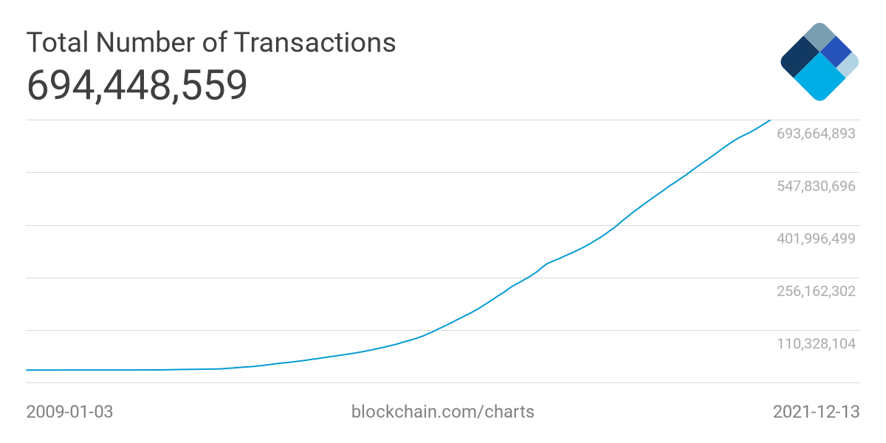

## A short introduction

The recession in which the modern world finds itself is globally recognized as the most severe in the last 90 years. The stratification of society, the deep economic crisis and the crisis of the functioning of markets, the growing interference of states and interstate associations in the daily life of individuals - these are not all the negative effects of the rapid technological, informational development, as well as the existing pandemic that we can observe.

Under these conditions, we can note the global trend of ordinary users to use those mechanisms and tools when participating in markets (by this we mean not only trading or investing, but also the daily processes of buying/selling goods and services), which allow:

* reduce the number of procedures and intermediaries required to complete a transaction between buyer and seller.
* provide the user with more anonymity and better protection of their data.
* in general, provide the user with a greater number of options to ensure the safety of his funds and protect them from inflationary processes.

Back in 1989, the company [DigiCash](https://ru.wikipedia.org/wiki/DigiCash) launched a digital cash system with anonymous transactions. Subsequently, this company ceased its activities, including due to a possible too early entry into the market.

In 1997, Adam Beck proposes a concept he developed [Hashcash](https://ru.wikipedia.org/wiki/Hashcash), which is essentially one of the prototypes of the Bitcoin protocol. The Hashcash algorithm is a Proof-of-Work system and was designed to reduce spam and DoS attacks.

In 2009, someone named Satoshi Nakamoto publishes the Bitcoin Whitepaper, in which he describes the principles of a decentralized peer-to-peer payment system. From this moment, we can start counting the full history of cryptocurrencies.

As of the end of 2022, there are more than 11,000 different cryptocurrencies in the world. The capitalization of various cryptocurrencies on the market varies from millions to hundreds of billions of dollars, the number of market users and the number of transactions in the networks is steadily growing.

---

### Cryptocurrency markets today

The growth of the total capitalization of cryptocurrency markets.

### Transaction amount

Increase in the number of transactions in the Bitcoin network.

The potential of cryptocurrencies based on decentralized systems and technologies to solve the problems of the centralized global market is undeniable, and this is confirmed by the steadily growing level of people's trust in this type of asset. Nevertheless, for all the development of technology, crypto-assets have not yet been fully integrated into the market sphere.

If we talk about modern markets, in one way or another related to cryptocurrencies, we can identify a number of key issues of paramount importance to the user.

## Current situation analysis

A lot of cryptocurrency projects provide one way or another the possibility to exchange the specified assets, but at the same time do not provide users with the possibility to use crypto-assets as an equivalent local means of payment/asset for intermediate exchange and expression of value of goods/services.

The existing applications do not take into account the need to keep records of acquisitions and sales, users do not have the ability to record information about transactions in a certain format in order to generate a service reporting documentation, which closes the access to the use of such applications by users in the status of a business entity.

The majority of users wishing to place a product/service for sale on the Internet face difficulties already at the initial stage:

* The **complexity of procedures** for specifying information about the product/service, description, uploading images.

* **Difficulties in price finding** due to the absence of price analysis mechanisms.

* The **complexity of ensuring control** over the execution of the terms of transactions, the presence of the risk of default by the parties to the transaction.

To ensure the reliability of transactions, it is often necessary to involve intermediaries - banks, notaries, lawyers, which increases the cost of transactions with goods/services for the user and lengthens their timing.

Analysis of sales markets is carried out in most cases by traditional methods and takes place at the expense of primitive surveys. This, in turn, leads to the fact that market participants do not have sufficiently accurate information about needs and intentions of buyers/sellers of goods and services.

> 

> Figure 3. Percentage of private e-commerce participants in the EU who refused to purchase goods and services due to excessive platform complexity or excessive security requirements:
