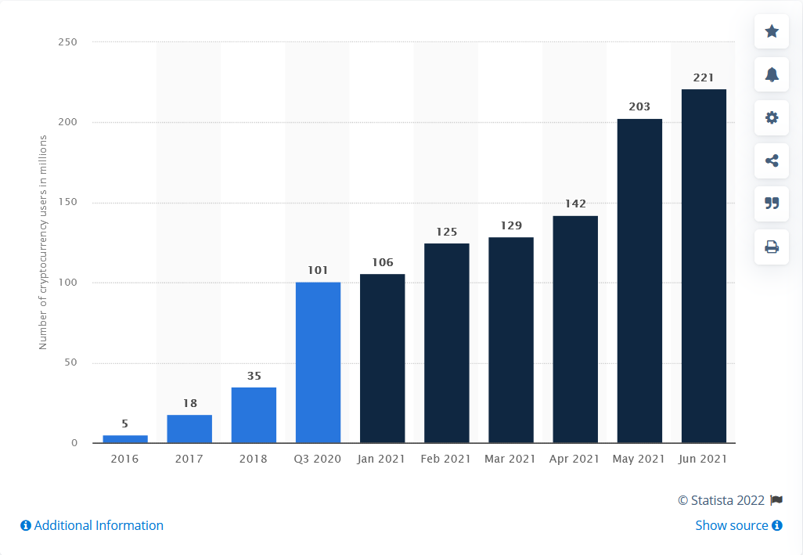

## Development of the idea

Interest in platforms that provide the greatest degree of interaction of users with each other and with the world around them emerged a long time ago and was developed in the formation of the concept of Web 3.0. A decentralized Internet that is not subject to control and censorship will inevitably allow the creation of ever better content and offer ever-increasing quality of services.

One of the interesting projects aimed at the practical implementation of the Web 3.0 concept was OpenBazaar, created in 2014. The project involved the creation of a decentralized platform allowing users to engage in online commerce using BTC.

An impressive community was formed around the project; by mid-2016, the project had more than 100,000 downloaded participants, and the service itself won three BlockchainAwards-2016 nominations - "Most Promising User Application," "Best New Startup" and "Bitcoin Champion of the Year.

However, despite the growing number of users (the OpenBazaar software was eventually installed more than 250,000 times), the service was subsequently discontinued for reasons unrelated to the decline in user interest (to this day, the user community is asking questions about the timing of resuming the service, or launching a similar one). As one of OpenBazaar co-founders Brian Hoffman said in his [interview](https://www.coindesk.com/business/2021/07/15/openbazaar-co-founder-explains-why-web-3s-answer-to-ebay-folded-its-tents/) to the Coindesk platform:

>...As for why OpenBazaar has not become widespread, there are countless possible reasons. The biggest one I can point to is that cryptocurrency, bitcoin in particular, went from being a cheap alternative to cash to a store of value - digital gold - which was not conducive to everyday shopping in e-commerce like Amazon. When Ethereum came along and took the bulk of the dapp from bitcoin, we were hesitant to join its board. I'm not sure it would have helped us, because so far no Ethereum-based alternative to OpenBazaar has emerged that has gotten much traction. Most of them have switched to selling only digital goods or unplayable tokens, which are much better suited to the instantaneous nature of cryptocurrency.

The aforementioned factors persist at the present time, and the degree of their influence on user sentiment is also growing. At the same time, the platform that could occupy the OpenBazaar niche does not exist to this day, and the created (even if not fully advertised) niche in the modern market remains unoccupied.

At the same time, the last two years have seen a steady increase in the interest of the average consumer in the C2C sector. As follows from the analysis conducted by the [CROSS-BORDER] platform (https://www.cbcommerce.eu)

>The total turnover of the cross-border e-commerce market in Europe, including the UK, Switzerland and Norway, is €198.5 billion in 2020 (excluding travel costs), of which €115.4 billion, or 58%, comes from trading platforms. Amazon and eBay have the lion's share of the market, with expected turnover of €44.3 billion and €22.8 billion in 2020, more than half the market. The turnover of the top 100 cross-border trading platforms in Europe reaches 100 billion euros. 
> 
> During the COVID-19 pandemic, trading platforms grew by 37.5% at the expense of C2C trading platforms. This growth is expected to continue and. to reach 65% of cross-border online sales in Europe by 2025

Thus, the emergence of a complete platform in the sector that meets the needs of users in terms of security, reliability, speed of transactions and accessibility will inevitably attract to its use the ever-increasing percentage of customers who focus primarily on e-commerce and C2C business models.

## Product description

[Produktor.io](https://produktor.io) is a mobile application based on a proprietary mapping service. The app is designed to facilitate C2C communication for users by enabling them to either directly exchange goods/services, or to do so using cryptocurrencies as an intermediate exchange asset or a LOCAL equivalent of a payment instrument.

The idea of the application emerged as a reaction to the analysis of existing markets and their drawbacks (see Introduction). Both the disadvantages associated with the overall centralized structure of markets and the integration of crypto-assets into global market processes were analyzed.

### Issues under consideration and ways to solve them

From the *developers* point of view, the main drawbacks of the existing markets of turnover of goods (turnover of services) at the level of private users and small businesses can be identified as the following:

#### Communication instability

Lack of unified norms of interpretation of laws and rules, technical problems of modern networks, increasing degree of state interference in market processes, other well-known problems of centralized systems.

Communicational instability, in its turn, leads to very negative consequences, limiting the potential of the existing system for further development - reduction of users' trust in the platforms providing services of exchange and purchase/sale of goods and services,   accumulation of technical errors, which inevitably lead to malfunction of the existing systems, supply chain disorders, the need to use the services of a vast class of intermediaries (lawyers, notaries, banks, courts), especially in case of different kinds of problems, the need to use the services of the intermediaries of the existing systems.

#### High taxes and strict regulation in commodity turnover

Participation of small and medium businesses in commodity exchange operations results in inclusion by their representatives in the price of such goods of amounts of taxes and fees affecting ultimately the price of goods/services for the end consumer. As for participation of individuals in this sector, their activities are seriously restricted at the legislative level - exceeding the volume of transactions or limits of money turnover may lead to the procedure of recognizing such a market participant as a person in the status of entrepreneur without appropriate registration, with all the legal consequences arising from this.

#### Excessive presence of intermediaries in the market

In the existing system, based on centralized regulation and control, there is a large layer of persons providing the widest range of services that can be conditionally referred to the class of intermediaries. It is impossible to make payments without using the modern banking system as an intermediary, it is often necessary to go through special registration procedures to participate in full-fledged barter transactions, and the emergence of disputes  and differences in the terms of contracts and agreements causes the involvement of additional actors in the relationship between the parties to the transaction - lawyers, escrow agents, notaries, the courts.

#### Growing number of crypto-asset holders with limited ability to fully use them

In recent years, the number of Internet users, somehow connected with cryptocurrencies, is constantly growing. At the same time, user activity is limited to investment and trading activities, as full-fledged integration of crypto-assets into the existing markets is currently impossible, primarily due to the uncertainty of regulation of this industry at the interstate and state levels. A huge amount of crypto-assets are held by users in their wallets, without taking any  participation in the commodity turnover.

From there we defined [main objectives](mission.md)
