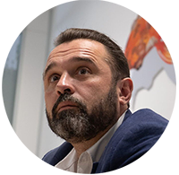

# Produktor Team

## Andrew Oblivantsev

*CTO, Engineer and Team Lead*

Founder of the project, has been already working on project technologies for more than four years. Developed the whole initial code base.

High level full-stack engineer, with a huge experience in IT sector including blockchain and crypto areas. 

He has worked with major companies and corporations such as Audi AG, Vodafone GmBH, Telekom Deutschland, Axel Springer SE, Deutsche Bahn, Baumüller and others.

## Alex Krylov

*CEO, Copywriter and Legal Assistant*

Lawyer with huge experience in Russia and Europe. Worked with big Russian and European companies in different projects. After being a general manager for the newest and biggest confectionary plant in Tenerife, Spain, has been working recently with investments projects in Spain and the Canary Islands.

As our strategic partner, the project is also supported by the team of [Tera](https://www.terafoundation.org) - new-generation blockchain, specially by its founder and leader Yuriy Ivanov.

> Joined the project in 2021.

## Open positions

We are currently forming our team. 
See if there's anything you can support **produktor**.

As the project develops (see the project [roadmap](business-plan#roadmap), the following additional resources need to be attracted:

- Marketing research, organization of marketing and advertising campaign, Q1, Q2 2022
- Legal support on specific issues such as:
  - Registration procedures
  - Licensing
  - Tax issues of the project's parent company 
- Financial and tax consulting 
- Development of CI, design of related materials 
- Helpdesk, customer service

### Team Lead

Follow skills will be needed:

* planning and organizing the team's work
* motivating the developers
* control of deadlines and work results
* adoption and implementation of management decisions
* back end development

> Expenses: 80-100k USD per year

### Software Engineer

Follow skills will be needed:

* Frontend development
  * Card processing
  * Working with blockchain (transactions and checks)
  * Creating smart contracts
* Writing tests
* Code documentation
* Application support
* Third line of user support

> Expenses: 50k-100k per year, depending on experience and speed of tasks

### Copywriter/Legal assistant

Follow skills will be needed:

* Formation, preparation and editing of a package of project documentation, including a business plan.
* control of document flow.
* handling of the main legal issues of the project (regulation, taxation, risks).
* Organizing and controlling corporate procedures (company registration, tax registration, obtaining necessary permits);
  at further stages of project development - organizing legal support for the project with the assistance of outside
  specialists.
* preparation, participation in negotiations
* Initial HR-activity - involvement of necessary specialists, control and coordination of their work, organization of
  necessary measures, control over internal reporting - with further transfer of these functions to Project Manager.

 > Expenses: 60-90k USD per year, depending on the amount of work

### Key account manager - Project Owner.

Follow skills will be needed:

* Interaction with investors, sponsors, partners, negotiations, signing agreements and contracts.
* Providing support to Project Manager.
* Presentation of the project.
* Preparation and signing of necessary investment agreements - in cooperation with copywriter.

> Expenses: 60-90k USD per year

### Quality Assurance / Quality Service

Follow skills will be needed:

- testing quality control of the application.
- identifying and analyzing errors and problems that users encounter while working with the application.
- development of autotests and their regular running.
- development of test scenarios.
- documenting the defects found.

> Expenses: 40k USD per year

