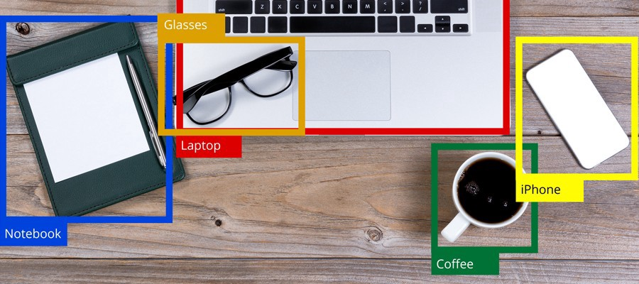
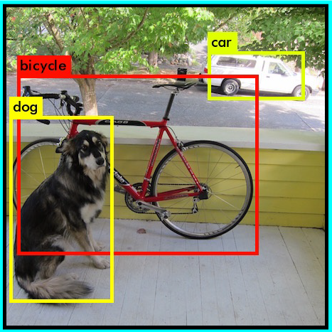
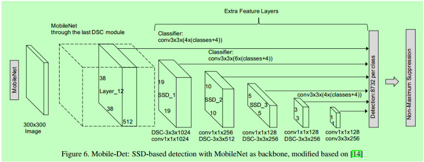

# Vision for using technology

In this section, we share our vision of how we want to use technology to simplify the process of entering and finding all kinds of products.

All the technologies listed below have long since moved from the realm of fiction to reality.

## Object recognition system

The application will enable automatic detection and identification of goods/products from the image captured by a
smartphone video camera, as well as recognition of significant properties and characteristics of the product using AI,
such as:

- Product name (by photo)
- Product description (by name)
- Product images, video or other media
- Average price (zone-based analysis of online prices)

### Usage examples

> Recognizing at home. 
> Next step is to select a product

> Would you like to exchange you dog?

### How it works

### Recognition on the fly

## Exchange calendar

The ability to temporarily plan the provision of goods/services by the user (downloading the information and the
schedule of work/providing goods or services)

## Exchange map

Possibility of geolocation of goods/services delivery zone with indication of exact location or zone borders.

Additional features are:

* Product placement and publishing
* Local product searching
* Interactive map with editing abilities

## Use of decentralized cryptocurrencies

Providing user with the possibility of quick and guaranteed crypto-assets exchange when performing transactions in the
application, or direct use of crypto-assets as a local means of payment.

# Efficient data saving

* Decentralized data distribution
* Efficient data storage based on IPFS/SkyDB

## User-friendly user interface

Minimally simple, intuitive user interface using:

- **maps** - to display the location of the product/service.
- **calendar** - to determine when a product/service is available for purchase by users.
- a convenient system for specifying essential information about a product/service or essential terms of sale.
- **wish list** is a system that allows users to leave requests or requests for future availability of certain
  goods/services in areas specified by users. This system will allow sellers of goods/services to always respond to
  current market demands, as well as constantly improve the accuracy, completeness and reliability of statistical
  information about markets for market research and business analysis purposes.
